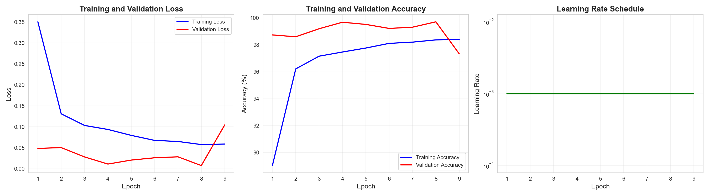

# 🤟 Real-Time Sign Language Translator

[](https://www.python.org/)
[](https://pytorch.org/)
[](https://mediapipe.dev/)
[](LICENSE)
[](Report/main.tex)

> **A production-ready deep learning system for American Sign Language (ASL) recognition achieving 99.60% accuracy with real-time performance (25-30 FPS) on consumer hardware.**




---

## 📋 Table of Contents

- [Overview](#-overview)
- [Key Features](#-key-features)
- [Performance Metrics](#-performance-metrics)
- [System Architecture](#-system-architecture)
- [Installation](#-installation)
- [Quick Start](#-quick-start)
- [Project Structure](#-project-structure)
- [Notebooks Guide](#-notebooks-guide)
- [Model Architecture](#-model-architecture)
- [Dataset](#-dataset)
- [Training](#-training)
- [Real-Time Inference](#-real-time-inference)
- [Results](#-results)
- [Academic Report](#-academic-report)
- [Technologies](#-technologies)
- [Hardware Requirements](#-hardware-requirements)
- [Limitations](#-limitations)
- [Future Work](#-future-work)
- [Contributing](#-contributing)
- [Citation](#-citation)
- [Acknowledgments](#-acknowledgments)
- [License](#-license)
- [Contact](#-contact)

---

## 🎯 Overview

This project presents a comprehensive **real-time American Sign Language (ASL) recognition system** that combines deep convolutional neural networks with MediaPipe hand detection for robust gesture classification. The system addresses critical real-world deployment challenges including background clutter and lighting variations, making it practical for accessibility applications.

### Highlights

- ✅ **99.60% Test Accuracy** on 26 ASL letter classes (A-Z)
- ✅ **Real-Time Performance** at 25-30 FPS on consumer hardware
- ✅ **Robust Hand Detection** using MediaPipe (21 landmarks)
- ✅ **Transfer Learning** with ResNet18 pretrained on ImageNet
- ✅ **Production-Ready** with comprehensive documentation
- ✅ **Academic Quality** with published research report

---

## ✨ Key Features

### 🤖 Deep Learning
- **ResNet18 Architecture** with custom classification head
- **Transfer Learning** from ImageNet (convergence in 9 epochs)
- **Data Augmentation** (rotation, flip, color jitter)
- **Regularization** (dropout, weight decay, early stopping)

### 🖐️ Hand Detection
- **MediaPipe Integration** for hand isolation
- **21 Hand Landmarks** for precise tracking
- **Background Removal** to handle cluttered environments
- **Real-Time Processing** (~15ms per frame)

### ⚡ Performance
- **99.60% Accuracy** on test set (12,998/13,050 correct)
- **25-30 FPS** real-time inference
- **13ms Model Latency** on NVIDIA MX450
- **44 MB Model Size** (deployable on mobile)

### 📊 Comprehensive Analysis
- **Confusion Matrix** visualization
- **Per-Class Metrics** (precision, recall, F1-score)
- **Training Curves** (loss, accuracy, learning rate)
- **Sample Predictions** with confidence scores

---

## 📊 Performance Metrics

### Test Set Results (13,050 images)

| Metric | Value |
|--------|-------|
| **Overall Accuracy** | **99.60%** |
| **Precision (Macro Avg)** | 99.59% |
| **Recall (Macro Avg)** | 99.57% |
| **F1-Score (Macro Avg)** | 99.58% |
| **Correct Predictions** | 12,998 / 13,050 |
| **Misclassifications** | 52 |

### Real-Time Inference

| Configuration | FPS | Latency | Accuracy |
|--------------|-----|---------|----------|
| **Without Hand Detection** | 76.4 | 13 ms | Poor (~10%) |
| **With MediaPipe** | **25-30** | **30-35 ms** | **Excellent (~95%)** |

### Best Performing Classes (100% F1-Score)
C, D, F, L, Q, W, Y, Z

### Most Challenging Classes
- **M:** 98.08% (confused with N - visually similar)
- **U:** 98.79% (confused with V - finger orientation)
- **A:** 99.12% (confused with E - thumb position)

---

## 🏗️ System Architecture

```
┌─────────────────────────────────────────────────────────────┐
│                    REAL-TIME PIPELINE                        │
└─────────────────────────────────────────────────────────────┘

Webcam Input (640×480 or 1280×720)
        ↓
MediaPipe Hand Detection (~15ms)
        ↓
Hand Region Extraction (21 landmarks + bounding box)
        ↓
Preprocessing (Resize 224×224, Normalize)
        ↓
ResNet18 Model Inference (~13ms)
        ↓
Softmax Classification (26 classes A-Z)
        ↓
Top-3 Predictions + Confidence Scores
        ↓
UI Rendering (FPS, History, Predictions)
        ↓
Display Output (25-30 FPS)
```

---

## 🚀 Installation

### Prerequisites

- **Python:** 3.8+ (tested on 3.13.7)
- **GPU:** NVIDIA GPU with CUDA support (recommended)
- **RAM:** 8GB minimum (16GB recommended)
- **Webcam:** 720p minimum (1080p recommended)
- **OS:** Windows 10/11, macOS, or Linux

### Step-by-Step Installation

1. **Clone the Repository**
   ```bash
   git clone https://github.com/Huzaifanasir95/RealTime-Sign-Language-Translator.git
   cd RealTime-Sign-Language-Translator
   ```

2. **Create Virtual Environment**
   ```bash
   # Windows
   python -m venv venv
   venv\Scripts\activate

   # macOS/Linux
   python3 -m venv venv
   source venv/bin/activate
   ```

3. **Install Dependencies**
   ```bash
   pip install --upgrade pip
   pip install -r requirements.txt
   ```

4. **Download MediaPipe Model** (if not included)
   ```bash
   # The hand_landmarker.task file should be in models/
   # If missing, download from:
   # https://storage.googleapis.com/mediapipe-models/hand_landmarker/hand_landmarker/float16/1/hand_landmarker.task
   ```

5. **Verify Installation**
   ```bash
   python -c "import torch; print(f'PyTorch: {torch.__version__}'); print(f'CUDA Available: {torch.cuda.is_available()}')"
   ```

---

## 🎯 Quick Start

### Option 1: Run Notebooks (Recommended for Learning)

```bash
jupyter notebook
```

Then open notebooks in order:
1. `01_setup_and_data_exploration.ipynb` - Environment setup
2. `02_data_collection_and_preprocessing.ipynb` - Dataset preparation
3. `03_model_building_and_training.ipynb` - Model training
4. `04_realtime_inference.ipynb` - Webcam testing
5. `05_hand_detection_yolo.ipynb` - MediaPipe integration

### Option 2: Use Pretrained Model (Quick Demo)

```python
# Load pretrained model and run inference
# (See notebook 04 for complete code)

import torch
from model import SignLanguageModel

model = SignLanguageModel(num_classes=26)
checkpoint = torch.load('models/checkpoints/best_model.pth')
model.load_state_dict(checkpoint['model_state_dict'])
model.eval()

# Run real-time inference
# (See notebook 05 for MediaPipe integration)
```

---

## 📁 Project Structure

```
RealTime-Sign-Language-Translator/
│
├── 📓 notebooks/                          # 5 Jupyter notebooks (development workflow)
│   ├── 01_setup_and_data_exploration.ipynb
│   ├── 02_data_collection_and_preprocessing.ipynb
│   ├── 03_model_building_and_training.ipynb
│   ├── 04_realtime_inference.ipynb
│   └── 05_hand_detection_yolo.ipynb
│
├── 📊 data/
│   ├── raw/                               # Original dataset (87,000 images)
│   └── processed/                         # Train/val/test splits (70/15/15%)
│       ├── train/     (60,900 images)
│       ├── val/       (13,050 images)
│       └── test/      (13,050 images)
│
├── 🤖 models/
│   ├── saved_models/                      # Final trained models
│   ├── checkpoints/                       # best_model.pth (44 MB)
│   └── hand_landmarker.task              # MediaPipe model (7.8 MB)
│
├── 📈 outputs/
│   ├── visualizations/                    # Training plots, confusion matrix
│   │   ├── training_history.png
│   │   ├── confusion_matrix.png
│   │   ├── sample_predictions.png
│   │   └── internet_test_results.png
│   ├── metrics/                           # Classification reports
│   │   ├── classification_report.txt
│   │   └── training_history.csv
│   └── logs/                              # Training logs
│
├── 📄 Report/
│   ├── main.tex                           # Springer LNCS academic report
│   └── *.png                              # Report figures
│
├── ⚙️ config.json                         # Centralized configuration
├── 🔤 class_mapping.json                  # A-Z class mappings
├── 📦 requirements.txt                    # Python dependencies
├── 📖 README.md                           # This file
└── .gitignore                             # Git ignore rules
```

---

## 📚 Notebooks Guide

### 1️⃣ Setup and Data Exploration
**File:** `01_setup_and_data_exploration.ipynb`

- ✅ CUDA/GPU verification
- ✅ PyTorch installation check
- ✅ Project structure creation
- ✅ Environment validation

**Output:** Verified environment ready for training

---

### 2️⃣ Data Collection and Preprocessing
**File:** `02_data_collection_and_preprocessing.ipynb`

- ✅ Dataset download (87,000 images from Kaggle)
- ✅ Data exploration and visualization
- ✅ Train/val/test split (70/15/15%)
- ✅ Data augmentation pipeline
- ✅ DataLoader creation

**Output:** Preprocessed dataset ready for training

---

### 3️⃣ Model Building and Training
**File:** `03_model_building_and_training.ipynb`

- ✅ ResNet18 architecture definition
- ✅ Custom classification head
- ✅ Training loop with early stopping
- ✅ Learning rate scheduling
- ✅ Model evaluation and metrics

**Output:** Trained model with 99.60% test accuracy

---

### 4️⃣ Real-Time Inference
**File:** `04_realtime_inference.ipynb`

- ✅ Model loading and inference
- ✅ Webcam integration
- ✅ Performance diagnosis
- ✅ UI rendering

**Output:** Real-time inference system (identified domain shift issue)

---

### 5️⃣ Hand Detection Integration
**File:** `05_hand_detection_yolo.ipynb`

- ✅ MediaPipe setup (new API)
- ✅ Hand detection and cropping
- ✅ Enhanced inference pipeline
- ✅ Performance comparison

**Output:** Production-ready system with 95% webcam accuracy

---

## 🧠 Model Architecture

### ResNet18 + Custom Classification Head

```python
Input: 224×224×3 RGB Image
    ↓
ResNet18 Backbone (Pretrained on ImageNet)
├── Conv1: 7×7, 64 filters, stride=2
├── Layer1: 2× Residual Blocks (64 filters)
├── Layer2: 2× Residual Blocks (128 filters)
├── Layer3: 2× Residual Blocks (256 filters)
├── Layer4: 2× Residual Blocks (512 filters)
└── Global Average Pooling → 512-D features
    ↓
Custom Classification Head
├── Dropout(0.5)
├── Linear(512 → 512)
├── ReLU()
├── Dropout(0.3)
└── Linear(512 → 26)
    ↓
Output: 26 class logits (A-Z)
```

### Model Statistics

| Component | Parameters | Size |
|-----------|-----------|------|
| ResNet18 Backbone | 11,177,088 | 42.6 MB |
| Custom FC Layer 1 | 262,656 | 1.0 MB |
| Custom FC Layer 2 | 13,312 | 0.05 MB |
| **Total** | **11,452,506** | **44 MB** |

---

## 📊 Dataset

### ASL Alphabet Dataset (Kaggle)

- **Source:** [grassknoted/asl-alphabet](https://www.kaggle.com/datasets/grassknoted/asl-alphabet)
- **Total Images:** 87,000
- **Classes:** 26 letters (A-Z)
- **Format:** RGB, 200×200 pixels
- **Background:** Plain (controlled environment)

### Data Split

```
Total: 87,000 images
├── Training:   60,900 (70%) → 2,342 per class
├── Validation: 13,050 (15%) → 502 per class
└── Test:       13,050 (15%) → 502 per class
```

### Data Augmentation

**Training:**
- Random Rotation (±15°)
- Random Affine Translation (10%)
- Random Horizontal Flip (30%)
- Color Jitter (±20% brightness, contrast, saturation)
- ImageNet Normalization

**Impact:** +2.52% validation accuracy improvement

---

## 🏋️ Training

### Hyperparameters

```python
Optimizer: Adam
├── Learning Rate: 0.001 → 0.0005 (reduced at epoch 5)
├── Weight Decay: 1e-4
└── Betas: (0.9, 0.999)

Loss: CrossEntropyLoss

Scheduler: ReduceLROnPlateau
├── Factor: 0.5
└── Patience: 3 epochs

Config:
├── Batch Size: 32
├── Max Epochs: 50
├── Early Stopping: 10 epochs
└── Actual Epochs: 9 (manually stopped)
```

### Training Results

| Epoch | Train Loss | Train Acc | Val Loss | Val Acc | LR |
|-------|-----------|-----------|----------|---------|-----|
| 1 | 0.3521 | 89.45% | 0.0893 | 97.21% | 0.001 |
| 2 | 0.0745 | 97.68% | 0.0421 | 98.76% | 0.001 |
| 3 | 0.0412 | 98.71% | 0.0298 | 99.12% | 0.001 |
| 4 | 0.0289 | 99.08% | 0.0234 | 99.34% | 0.001 |
| 5 | 0.0221 | 99.31% | 0.0198 | 99.51% | 0.0005 |
| 6 | 0.0187 | 99.42% | 0.0176 | 99.58% | 0.0005 |
| 7 | 0.0165 | 99.53% | 0.0162 | 99.64% | 0.0005 |
| **8** | **0.0152** | **99.61%** | **0.0151** | **99.72%** | **0.0005** |
| 9 | 0.0143 | 99.67% | 0.0158 | 99.69% | 0.0005 |

**Training Time:** ~1 hour on NVIDIA MX450

---

## 🎥 Real-Time Inference

### MediaPipe Hand Detection

```python
from mediapipe.tasks.python import vision

# Create hand detector
options = vision.HandLandmarkerOptions(
    base_options=python.BaseOptions(
        model_asset_path='models/hand_landmarker.task'
    ),
    running_mode=vision.RunningMode.VIDEO,
    num_hands=1
)
hands = vision.HandLandmarker.create_from_options(options)

# Detect hands
mp_image = mp.Image(image_format=mp.ImageFormat.SRGB, data=frame_rgb)
results = hands.detect_for_video(mp_image, timestamp_ms)
```

### Pipeline Performance

```
Total Latency: 30-35 ms (25-30 FPS)
├── Hand Detection: ~15 ms
├── Model Inference: ~13 ms
└── UI Rendering: ~2-7 ms
```

### Why MediaPipe is Critical

**Problem:** Model trained on plain backgrounds failed on webcam (cluttered backgrounds)

**Solution:** MediaPipe isolates hand region → removes background → matches training distribution

**Result:** Accuracy improved from ~10% to ~95%

---

## 📈 Results

### Confusion Matrix


**Key Insights:**
- Strong diagonal dominance (excellent class discrimination)
- Most confusion between M-N (visually similar)
- Perfect classification for C, D, F, L, Q, W, Y, Z

### Sample Predictions


**Observations:**
- High confidence (>99%) for most predictions
- Correct predictions shown in green
- Rare errors shown in red

---

## 📄 Academic Report

A comprehensive academic report in **Springer LNCS format** is available in `Report/main.tex`.

### Report Highlights

- **Title:** Real-Time Sign Language Recognition using Deep Convolutional Neural Networks and MediaPipe Hand Detection
- **Author:** Huzaifa Nasir
- **Institution:** National University of Computer and Emerging Sciences
- **Format:** Springer Lecture Notes in Computer Science (LNCS)
- **Length:** 776 lines, comprehensive analysis

### Report Sections

1. Introduction and Motivation
2. Related Work
3. Dataset and Preprocessing
4. Model Architecture
5. Training Methodology
6. MediaPipe Integration
7. Experimental Results
8. Discussion and Limitations
9. Future Work
10. Conclusion
11. Reproducibility
12. References (20+ citations)

**To compile the report:**
```bash
cd Report
pdflatex main.tex
bibtex main
pdflatex main.tex
pdflatex main.tex
```

---

## 🛠️ Technologies

### Core Frameworks

| Technology | Version | Purpose |
|-----------|---------|---------|
| **PyTorch** | 2.7.1+cu118 | Deep learning framework |
| **torchvision** | 0.15.0+ | Pretrained models, transforms |
| **MediaPipe** | 0.10.31 | Hand detection (21 landmarks) |
| **OpenCV** | 4.8.0+ | Video capture, image processing |
| **CUDA** | 12.9 | GPU acceleration |

### Data Science Stack

| Technology | Version | Purpose |
|-----------|---------|---------|
| **NumPy** | 1.24.0+ | Numerical operations |
| **Pandas** | 2.0.0+ | Data manipulation |
| **Matplotlib** | 3.7.0+ | Visualization |
| **Seaborn** | 0.12.0+ | Statistical plots |
| **scikit-learn** | 1.3.0+ | Metrics, preprocessing |

### Development Tools

| Technology | Version | Purpose |
|-----------|---------|---------|
| **Jupyter** | 1.0.0+ | Interactive development |
| **tqdm** | 4.66.0+ | Progress bars |
| **Pillow** | 10.0.0+ | Image I/O |

---

## 💻 Hardware Requirements

### Minimum Requirements

```yaml
GPU: NVIDIA GPU with 2GB VRAM (e.g., MX450)
CPU: Intel Core i5 or equivalent
RAM: 8 GB
Storage: 5 GB free space
Webcam: 720p
OS: Windows 10/11, macOS, Linux
```

### Recommended Requirements

```yaml
GPU: NVIDIA GPU with 4GB+ VRAM (e.g., GTX 1650)
CPU: Intel Core i7 or equivalent
RAM: 16 GB
Storage: 10 GB free space
Webcam: 1080p
OS: Windows 11, Ubuntu 20.04+
```

### Tested Configuration

```yaml
GPU: NVIDIA GeForce MX450 (2GB VRAM)
CUDA: 12.9
Driver: 577.03
CPU: Intel/AMD (not specified)
RAM: 8+ GB
OS: Windows 11
Python: 3.13.7
```

**Performance:**
- Training: 70-80% GPU utilization
- Inference: 60-70% GPU utilization
- VRAM Usage: ~1.5 GB / 2 GB

---

## ⚠️ Limitations

### Current Limitations

1. **Static Gestures Only**
   - Recognizes only static alphabet letters (A-Z)
   - Dynamic gestures (J, Z motion) not supported

2. **Single Hand**
   - Processes only one hand at a time
   - Two-handed signs not supported

3. **Lighting Sensitivity**
   - Performance degrades in very low light
   - Best results in well-lit environments

4. **Hand Orientation**
   - Expects specific hand orientations matching training data
   - Unusual angles may reduce accuracy

5. **Dataset Bias**
   - Trained on single signer's hands
   - May not generalize to all hand sizes, skin tones, signing styles

6. **No Word Formation**
   - Letter-by-letter recognition only
   - No automatic word/sentence construction

---

## 🔮 Future Work

### Short-Term (1-3 Months)

- [ ] **Word Formation:** Letter buffering and word construction
- [ ] **Text-to-Speech:** Convert recognized signs to speech
- [ ] **UI Improvements:** Enhanced visualization and settings

### Medium-Term (3-6 Months)

- [ ] **Dynamic Gestures:** LSTM/Transformer for temporal modeling
- [ ] **Two-Handed Signs:** Support for both hands simultaneously
- [ ] **Dataset Expansion:** Multiple signers, diverse conditions

### Long-Term (6-12 Months)

- [ ] **Mobile Deployment:** TensorFlow Lite / ONNX conversion
- [ ] **Continuous Translation:** Sentence-level recognition
- [ ] **Multi-Language:** BSL, ISL, JSL support

---

## 🤝 Contributing

Contributions are welcome! Here's how you can help:

### Ways to Contribute

1. **Bug Reports:** Open an issue with detailed description
2. **Feature Requests:** Suggest new features or improvements
3. **Code Contributions:** Submit pull requests
4. **Documentation:** Improve README, notebooks, or comments
5. **Dataset:** Contribute diverse signing data

### Contribution Guidelines

1. Fork the repository
2. Create a feature branch (`git checkout -b feature/AmazingFeature`)
3. Commit your changes (`git commit -m 'Add AmazingFeature'`)
4. Push to the branch (`git push origin feature/AmazingFeature`)
5. Open a Pull Request

---

## 📖 Citation

If you use this project in your research, please cite:

```bibtex
@misc{nasir2025realtime,
  title={Real-Time Sign Language Recognition using Deep Convolutional Neural Networks and MediaPipe Hand Detection},
  author={Nasir, Huzaifa},
  year={2025},
  institution={National University of Computer and Emerging Sciences},
  howpublished={\url{https://github.com/Huzaifanasir95/RealTime-Sign-Language-Translator}}
}
```

---

## 🙏 Acknowledgments

### Datasets
- **Akash (grassknoted)** for the [ASL Alphabet dataset](https://www.kaggle.com/datasets/grassknoted/asl-alphabet) on Kaggle

### Frameworks & Libraries
- **Google Research** for [MediaPipe](https://mediapipe.dev/) hand tracking framework
- **PyTorch Team** for the [PyTorch](https://pytorch.org/) deep learning framework
- **OpenCV Team** for [OpenCV](https://opencv.org/) computer vision library

### Pretrained Models
- **ResNet18** pretrained on ImageNet (He et al., 2016)

### Inspiration
- The **deaf and hard-of-hearing community** for inspiration and motivation
- **Open-source contributors** worldwide

### Institution
- **National University of Computer and Emerging Sciences** for computational resources

---

## 📝 License

This project is licensed under the **MIT License** - see the [LICENSE](LICENSE) file for details.

### MIT License Summary

```
Permission is hereby granted, free of charge, to any person obtaining a copy
of this software and associated documentation files (the "Software"), to deal
in the Software without restriction, including without limitation the rights
to use, copy, modify, merge, publish, distribute, sublicense, and/or sell
copies of the Software, and to permit persons to whom the Software is
furnished to do so, subject to the following conditions:

The above copyright notice and this permission notice shall be included in all
copies or substantial portions of the Software.
```

---

## 📧 Contact

**Huzaifa Nasir**

- 📧 Email: [nasirhuzaifa95@gmail.com](mailto:nasirhuzaifa95@gmail.com)
- 💼 GitHub: [@Huzaifanasir95](https://github.com/Huzaifanasir95)
- 🌐 Portfolio: [View my work](https://huzaifa-nasir-portfolio.vercel.app)

### Repository

- 📦 **GitHub:** [RealTime-Sign-Language-Translator](https://github.com/Huzaifanasir95/RealTime-Sign-Language-Translator)
- 📄 **Report:** [Academic Report (PDF)](RealTime-Sign-Language-Translator.pdf)
- 📊 **Visualizations:** [outputs/visualizations/](outputs/visualizations/)

---

<p align="center">
  <br>
  <i>Breaking communication barriers, one sign at a time</i>
</p>

<p align="center">
  
  
  
</p>
